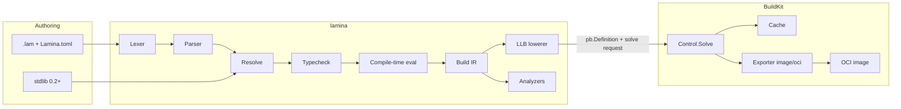
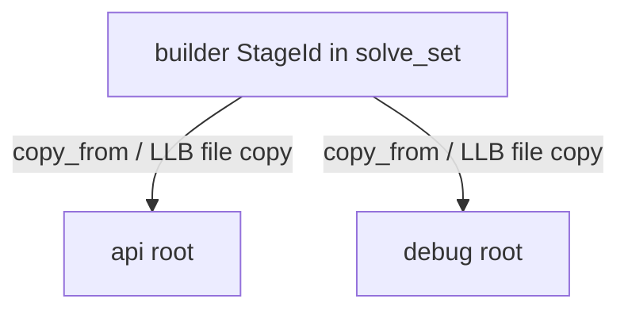
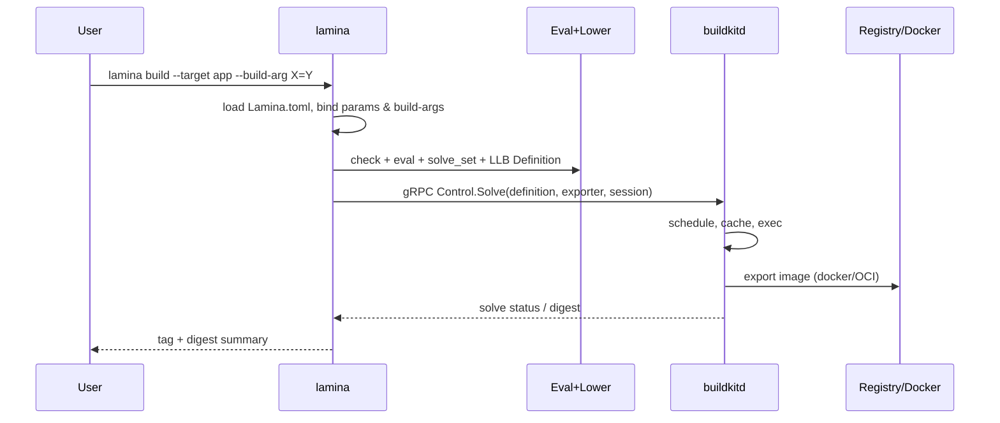
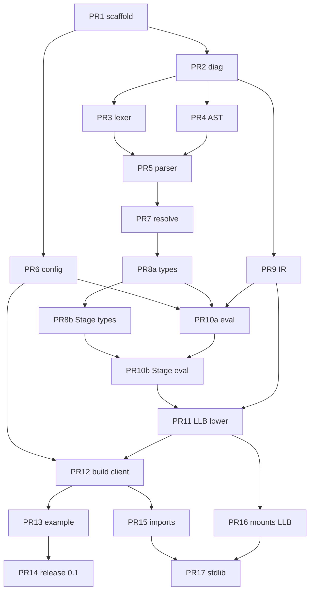

# Lamina Design Document

| Field | Value |
|-------|-------|
| **Title** | Lamina — A Programming Language for Building Container Images |
| **Author** | TBD (project maintainers) |
| **Date** | 2026-08-01 |
| **Status** | Draft (rev 6 — **rename: Lamina**) |
| **Version** | 0.2.2-design |
| **Repository** | https://github.com/VitorRamos/lamina |

---

## Overview

**Lamina** is a fully featured programming language for describing container image builds—with functions, modules, types, and composition—that **compiles to BuildKit LLB** and **solves** that graph through a BuildKit daemon (`buildkitd` / Docker Buildx). The product artifact is an **OCI image** produced by BuildKit, not a generated Dockerfile.

The name **Lamina** (thin layer / sheet) reflects image builds as **composed layers and stages**, not as Docker-specific scripts. Former working name: *Docklang*.

**Packaging names (normative):**

| Role | Name |
|------|------|
| Product / language | Lamina |
| CLI | `lamina` |
| Config | `Lamina.toml` |
| Source extension | `.lam` |
| Crates | `lamina` (lib), `lamina-cli` (binary `lamina`), `lamina-llb`, `lamina-client` |

```text
.lam  →  (lamina compiler)  →  LLB  →  BuildKit  →  OCI image
```

instead of:

```text
Dockerfile  →  (Dockerfile frontend)  →  LLB  →  BuildKit  →  OCI image
```

This **overrides** earlier revisions (rev 1–3) that treated standard Dockerfile text as the primary backend and “Dockerfile-as-contract” as the product bet. The language surface (Stage values, functions, params, frozen MVP grammar) is largely preserved; the **backend and integration story are LLB-native**.

**Revision note (rev 4 — user pivot):**

> User decision (final): Lamina must **not** generate Dockerfiles as the primary or default output. Lamina must **generate BuildKit LLB directly** (or compile to an LLB-consuming path: custom frontend / `buildctl` / Buildx gateway).

**Revision note (rev 5 — discussion alignment):**

> Folded product-discussion motivation: concrete multi-variant / template use cases (cross-rs, dockcross, docker-rust), remote module composition as a phased headline goal, aspirational vs frozen surface syntax, and an explicit “ecosystem-compatible ≠ drop-in Dockerfile” compatibility statement.

**Revision note (rev 6 — rename):**

> Product renamed from **Docklang** to **Lamina**. CLI `dockc` → `lamina`, `Dock.toml` → `Lamina.toml`, sources `.dk` → `.lam`. Remote: `git@github.com:VitorRamos/lamina.git`.

Rev 2–3 work that still holds: two-tier Stage kernel, immutable Stage / fork semantics, **solve-set** algorithm (formerly emission-set), ARG/param model (mapped to BuildKit build-args), frozen MVP grammar with `for` → `List[U]`, eval caps, IR-decidable lints, 0.1 = single-file + solve, umbrella Rust crate. **Discarded as product contract:** Dockerfile emitter, `# syntax=` emission, hadolint goldens, “review the Dockerfile in PRs,” Dockerfile parity matrix as the capability tracker.

---

## Product bet

> **Author image builds in a real, typed language; execute them as a precise BuildKit LLB graph**—full mounts, secrets, concurrency, and cache semantics—without a lossy lower-to-Dockerfile step.

| Review surface in PRs | What users look at |
|-----------------------|--------------------|
| Primary | `.lam` sources + `Lamina.toml` |
| Secondary | `lamina explain` / `lamina emit-llb` (debug graph dump) |
| Not required | Generated Dockerfiles |

### Compatibility with Docker and BuildKit (normative)

“Fully compatible with the existing OCI and BuildKit ecosystem” means **outputs and execution**, not “drop-in replacement for `docker build -f Dockerfile` without lamina.”

| Compatible | Not the default path |
|------------|----------------------|
| OCI image layouts and tags BuildKit already exports | Plain `docker build -f Dockerfile` on Lamina sources |
| BuildKit cache, mounts, platforms, exporters | Reviewing / shipping generated Dockerfiles as source of truth |
| Docker daemon / Buildx as image store after solve (`-t`, load) | Zero new tooling for authors |
| Optional later: BuildKit gateway frontend so `buildx build -f image.lam` works | Requiring only stock Dockerfile frontend forever |

**Trade-off accepted:** users need `lamina build` (or a registered BuildKit frontend) and a BuildKit builder. The ecosystem win is **standard images and BuildKit semantics**, not authoring Dockerfiles.

Optional **post-0.1** `lamina emit-dockerfile` may exist as a **lossy debug/export** tool only—not a v1 product contract, not CI source of truth, not the test oracle.

---

## Background & Motivation

### Why leave Dockerfile generation behind

Dockerfile is a lossy, sequential authoring format:

- Weak abstraction (no functions/modules).
- Control flow lives in shell inside `RUN`.
- Multi-stage edges are stringly (`COPY --from=name`).
- Custom BuildKit features exist, but **LLB is the real IR** of BuildKit; Dockerfiles are one frontend among many.

Earlier Lamina drafts generated Dockerfiles to maximize portability. That choice conflicts with the user’s revised goal: **fully leverage BuildKit** via LLB. Generating Dockerfiles and re-parsing them through the Dockerfile frontend adds:

- Lossy round-trips (instruction ordering, merge heuristics, heredoc/mount edge cases).
- Double compilation (lamina → Dockerfile text → Dockerfile frontend → LLB).
- Inability to express LLB-native graphs cleanly (shared vertices, fine-grained mounts, concurrent branches).

### Prior art (LLB-adjacent)

| System | Relationship to LLB |
|--------|---------------------|
| **BuildKit Dockerfile frontend** | Source → LLB inside BuildKit |
| **HLB** | High-level language → LLB |
| **Earthly** | Earthfile → BuildKit (LLB under the hood) |
| **Dagger** | Engine APIs; not Dockerfile-primary |
| **docker-bake** | Orchestrates builds; recipes still often Dockerfiles |

Lamina’s niche: **purpose-built PL + Stage-centric types + direct LLB backend**, implementable by a small team, without becoming a full CI platform.

### Pain points Lamina targets

| Pain | Approach |
|------|----------|
| Duplication | Functions + modules (0.2+) |
| Parameterized variants | Compile-time `param` + BuildKit build-args |
| Opaque generators | Structured Build IR + `explain` / optional LLB dump |
| Policy mistakes | IR lints before solve |
| Secrets & mounts | First-class mounts → LLB exec mounts |
| Need for real BuildKit power | **Direct LLB**, not text Dockerfile |
| Template sprawl (N Dockerfiles / `.in` generators) | One definition + params/functions → many targets |

### Motivating real-world use cases

Target audience: teams that already do **multi-stage builds, many near-identical variants, or Dockerfile templating**—not “I have one simple Dockerfile.”

#### 1. Cross-compilation matrix (cross-rs)

[cross-rs/cross `docker/`](https://github.com/cross-rs/cross/tree/main/docker) maintains a **dozen+ near-identical Dockerfiles**, one per target triple (`Dockerfile.aarch64-unknown-linux-gnu`, `x86_64-…`, `armv7-…`, Android/musl/FreeBSD/Windows variants, etc.). Shared setup is partly factored into shell scripts (`common.sh`, `cmake.sh`, `qemu.sh`), but the Dockerfiles themselves still repeat:

- same base and common setup stages  
- arch-specific package lists that differ only by architecture name  
- 15+ `ENV` lines that only differ by triple / sysroot prefix  

Changing the Ubuntu base, a shared package, or an env pattern requires touching many files. With Lamina this becomes one parameterized definition plus many thin targets:

```dk
// Conceptual 0.2+ shape (stdlib + params)—not 0.1 grammar
fn linux_gnu_target(arch: String, triple: String) -> Stage {
  let base = Stage.from("ubuntu:24.04")
    .run("…common setup…")
    .run("…cmake…");
  // arch toolchain, qemu, dropbear, linux-image, env_toolchain(triple, arch) …
  base.env("CROSS_TOOLCHAIN_PREFIX", triple + "-")
}

pub target aarch64_linux_gnu = linux_gnu_target("aarch64", "aarch64-unknown-linux-gnu");
pub target x86_64_linux_gnu  = linux_gnu_target("x86_64",  "x86_64-unknown-linux-gnu");
// … one line per triple instead of one Dockerfile per triple
```

#### 2. Official image families (docker-rust templates)

[rust-lang/docker-rust](https://github.com/rust-lang/docker-rust) uses **`Dockerfile-slim.template` + a Python generator** to emit concrete Dockerfiles. The real product is the generator; review and drift live in template + script. Lamina makes the parameterized definition the **source of truth** (typed params, functions, IR explain) instead of text substitution.

#### 3. Toolchain image projects (dockcross)

[dockcross/dockcross](https://github.com/dockcross/dockcross) uses **`dockerfile.in` templating** for many cross-toolchain images. Same pattern as (1)/(2): template engine around Dockerfile, not a language with Stage values and composition.

#### What multi-stage Dockerfiles do not buy you

`FROM … AS` + `COPY --from=` can share artifacts, but:

- reuse across **repos / teams** is copy-paste or external generators;  
- **N variants** still mean N files or a custom template stack;  
- there is no typed function/module boundary for “install clang on this Stage and return it.”  

Lamina’s bet is **functions, modules, and Stage composition** for that audience—not replacing every one-file Dockerfile.

### Composition vision (phased)

**Headline goal (product narrative):** reusable modules and composition of building blocks—stdlib recipes, path dependencies, and eventually remote/importable image libraries—so authors write:

```text
// Aspirational / post-1.0 narrative (not frozen MVP syntax)
use cross::base
use cross::linux_gnu

fn linux_gnu_target(arch: Arch, triple: string) -> Image { … }
image Aarch64LinuxGnu() = linux_gnu_target(Aarch64, "aarch64-unknown-linux-gnu")
```

or higher-level composition:

```text
// Aspirational: import hardened bases + toolchains, return runtime image
base = ubuntu.minimal(version = "24.04")
base = rust.stable(base, components = ["clippy", "rustfmt"])
base = node.lts(base, version = "22")
return ubuntu.runtime(base, strip = true)
```

**Phasing (normative):**

| Phase | Composition capability |
|-------|------------------------|
| **0.1** | Single file; `fn` + `Stage` methods + `param` / `arg`; no `import` |
| **0.2** | Path-only modules + stdlib recipes (`std.golang`, …) |
| **1.0** | Path lockfile; documented module layout |
| **Post-1.0 / open** | Remote module resolution (git URL / registry); exact package UX **open** |

Remote `use github.com/acme/images/…` is a **design goal of the product story**, not a 0.1 deliverable. Supply-chain defaults: path-only first; remote requires lockfile + fetch policy before it is default-on.

---

## Goals & Non-Goals

### Goals

1. **Fully featured language** (phased): functions, control flow, types; modules from 0.2; remote composition post-1.0 (open design).
2. **LLB-primary backend:** compile Build IR → LLB `pb.Definition`; **solve** via BuildKit Control API; produce OCI images / local Docker tags.
3. **BuildKit-concept fidelity** (capability matrix): base images, exec (`RUN`), file ops (`COPY`/`ADD`-like), env/user/workdir metadata, multi-stage DAGs, platforms, cache mounts, secret/ssh/bind mounts, exporters (image, local, tar).
4. **Composition & reuse:** Stage values, functions; stdlib recipes 0.2+; path modules → lockfile → optional remote modules.
5. **Static analysis (IR-decidable)** before solve: empty stages, unused stages, root-final policy, secret-like env keys, unpinned base refs (policy).
6. **Solo/small-team implementable:** 0.1 = single-file language + LLB lower + `lamina build` against local BuildKit.
7. **Debuggable builds:** `lamina explain`, optional `emit-llb`, source spans in progress logs where feasible; PR review of `.lam` sources.
8. **Ecosystem outputs:** images and BuildKit behavior users can run with ordinary Docker/OCI tooling after solve—without requiring Dockerfile text as intermediate.

### Non-Goals

- **Not Dockerfile-primary.** Generating Dockerfiles is **not** the product contract. Optional debug exporter only post-0.1.
- **Not a drop-in for `docker build -f` on stock Dockerfile frontend** without `lamina` or a Lamina BuildKit frontend (see Compatibility).
- **Not a general-purpose application language.**
- **Not a CI orchestrator** (no deploy DAG / test platform).
- **Not a replacement for BuildKit** — we are a client/frontend producer of LLB.
- **Not hermetic like Nix.**
- **Not multi-context (named external contexts) in 0.1** — phase 1.x.
- **Not remote module registry in 0.1** (nor required for 1.0); path modules land first.
- **No Dockerfile `s.raw` escape hatch** (N/A). Optional later: constrained low-level LLB op escape (post-1.0, lint-noisy)—not MVP.

### Success metrics

**0.1**

| Metric | Target |
|--------|--------|
| `examples/hello-static` multi-stage Go image via intrinsic Stage ops | Solves successfully with `lamina build`; image runs |
| Golden / semantic tests | Stable LLB vertex summaries or solve digests under fixture builder; not Dockerfile text |
| `lamina check` | Typecheck + IR build without daemon |
| Cold `lamina check` on hello-static | &lt; 500 ms |
| Scope | Single-file; no Dockerfile emitter required |

**1.0**

| Metric | Target |
|--------|--------|
| Mounts, secrets, platforms | Capability matrix “supported” |
| Modules + path deps + stdlib recipes | Documented |
| Lint pack | `--deny` in CI |
| Frontend optional path | Documented gateway or `lamina build` only |
| Multi-variant composition | At least one example that factors N near-identical targets via `fn` + path modules (cross-rs-class) |

**Post-1.0 (vision, not gate)**

| Metric | Target |
|--------|--------|
| Remote modules | Design + optional prototype (git/registry); not required for 1.0 |

---

## Proposed Design

### Design philosophy

**“Rust-grade structure, BuildKit-grade execution.”**

- Author with Stage-centric functional composition.
- Compile-time evaluation builds a **Build IR DAG**.
- Lowering produces **LLB ops** (vertices + edges), not Dockerfile lines.
- BuildKit executes, caches, and exports.

### High-level architecture



### Syntax philosophy

Unchanged in spirit from rev 3. **Normative for implementation is the frozen MVP grammar (Appendix A)**, not every sketch used in product discussions.

| Choice | Decision |
|--------|----------|
| Stage methods | `Stage.from`, `.run`, `.copy`, … (intrinsics) |
| Structure | braces, typed `fn` |
| Files | `.lam`, `Lamina.toml` |
| MVP stage form | Fluent methods only |
| Control flow | `if`, `for` → `List[U]` at compile time |
| Targets | `pub target name = <Stage expr>` (not a separate `image Name() { … }` keyword in 0.1) |

#### Aspirational surface vs frozen MVP

Early product sketches used forms like `image UbuntuDev(features: list[Feature] = []) { from("ubuntu:24.04") … }`, keyword-ish `from`/`run` inside an image block, or remote `use github.com/…`. Those convey **intent** (named images, params, composition). They are **not** the 0.1 language.

| Idea in discussion sketches | Lamina (normative) |
|-----------------------------|----------------------|
| `image Foo() { … }` | `pub target foo = { … }` or `pub target foo = some_fn(…)` |
| Bare `from("…")` / `run("…")` in a block | `Stage.from("…").run("…")` fluent methods |
| `use github.com/acme/…` | No imports in 0.1; path modules 0.2; remote post-1.0 open |
| Keyword-only params, rich defaults | Positional/`param`/`arg` model per frozen grammar; expand later if needed |
| `module WebService { fn … }` | `fn` in a file; modules = files/packages when imports land |

Future syntax sugar (e.g. block-stage form, `image` alias for `target`) may be considered **only** if it desugars cleanly to Stage IR and does not fork the mental model. Until then, docs and examples use **Stage + target**.

### Two-tier Stage model (intrinsic kernel vs stdlib)

**Unchanged decision:**

| Tier | What | Where | When |
|------|------|-------|------|
| **Tier 0 — Intrinsic kernel** | `Stage`, `Mount`, core methods | Rust builtins → IR → LLB | MVP |
| **Tier 1 — Stdlib recipes** | `std.golang`, `std.node`, … | `.lam` calling intrinsics | 0.2+ |

Methods on `Stage` are **true builtins**, not desugared to `std.stage.*`.

**Intrinsic signatures (0.1)** — same as rev 3 language surface; semantics now mean “append IR instr that lowers to LLB,” not “append Dockerfile line”:

```text
Stage.from(image: String) -> Stage
Stage.from_arg(name: String) -> Stage   // base image from build-arg
(s: Stage).workdir(path: String) -> Stage
(s: Stage).run(command: String) -> Stage
(s: Stage).copy(src: String, dst: String) -> Stage
(s: Stage).copy_many(srcs: List[String], dst: String) -> Stage
(s: Stage).copy_from(from: Stage, src: String, dst: String) -> Stage
(s: Stage).env(key: String, value: String) -> Stage
(s: Stage).arg(name: String) -> Stage
(s: Stage).arg_default(name: String, default: String) -> Stage
(s: Stage).user(user: String) -> Stage
(s: Stage).entrypoint(args: List[String]) -> Stage
(s: Stage).cmd(args: List[String]) -> Stage
(s: Stage).expose(port: Int) -> Stage
(s: Stage).name(stage_name: String) -> Stage  // debug / explain label only in LLB path
```

0.2+ intrinsics: `run_with` + `Mount.*`, `label`, `healthcheck`, `shell`, platforms.

### Stage operational semantics

Stages remain **immutable values**; method calls return new `StageId`s; forking allowed; structural hash-cons **off** by default.

**Representation** — same `StageVal { id, name, from, parent, instrs }` with full-list or parent+delta storage.

**Rules 1–5** (construction, extension, fork, identity, naming) — as in rev 3, with naming used for **explain labels**, progress UI, and stable debug dumps—not Dockerfile `AS`.

#### Rule 6 — Solve set (normative; replaces “emission set”)

Intermediate fluent `StageId`s are **evaluator storage**, not separate solve roots. Only the **solve set** becomes LLB result vertices requested from BuildKit.

```text
// 1. Roots = selected pub target StageIds
roots := { StageId of each selected target }

// 2. Close under copy_from sources only (NOT under linear/storage parents)
solve_set := roots
worklist := roots
while worklist non-empty:
  id := pop(worklist)
  for each CopyFrom in materialize_full_instrs(id):
    if instr.from ∉ solve_set:
      solve_set ∪= { instr.from }
      worklist ∪= { instr.from }

// 3. Lower each solve_set member to ONE logical image config + FS chain in LLB
//    Flatten parent+delta storage into full instruction lists.
//    Do NOT create separate LLB “stages” for storage-only parents.

// 4. Wire copy_from as LLB file ops from source state’s mount/output
//    Shared StageId → single LLB subgraph, referenced by multiple consumers

// 5. Solve: request export of each selected root (or single default root)
```

**Example:**

```dk
let a = Stage.from("alpine").run("echo 1");
let b = a.run("echo 2");
pub target t = b;
```

→ `solve_set = { b }` → one FS chain: base alpine + `echo 1` + `echo 2`. Not two independent images.

**Fork:** one `builder` StageId, two finals `copy_from(builder)` → builder subgraph lowered once; two exportable roots if both are targets.



### Core language features

#### Types, control flow, functions, modules

As rev 3:

- Primitives `String`/`Int`/`Bool`, `List[T]`, builtin `Stage` (+ `Mount` in 0.2).
- `const`/`let` immutable; `if` expressions; **`for` in 0.1** yielding `List[U]` (Appendix A).
- Functions; no keyword-only params in 0.1.
- Modules/imports from 0.2; path-only deps until lockfile; remote modules post-1.0 (open design—see Composition vision).

#### Params vs build-args (ARG model, LLB mapping)

| Channel | Bound when | How it reaches BuildKit | Use |
|---------|------------|-------------------------|-----|
| **Compile-time `param`** | `lamina` | Already substituted into IR/LLB (image refs, command strings) | Variants chosen before solve |
| **Global build-arg** (`arg "NAME"` at module scope) | Solve time (`--build-arg` / solve options) | Passed in `SolveRequest.FrontendAttrs` / session build-args; base via `Stage.from_arg` resolves using arg at solve | Parameterize base image without recompile |
| **Stage build-arg** (`s.arg`) | Solve / exec meta | Available to subsequent `run` execs in that stage’s chain as BuildKit build-arg/env wiring per lowerer rules | Per-stage args |

**Compile-time param into base (no solve-time arg):**

```dk
const BASE: String = param("base_image", "golang:1.22-bookworm");
let s = Stage.from(BASE);
```

**Solve-time base image:**

```dk
arg "GO_BASE", "golang:1.22-bookworm";
let builder = Stage.from_arg("GO_BASE")
  .arg_default("GO_BASE", "golang:1.22-bookworm")
  .run("echo $GO_BASE")
  .name("builder");
```

Lowering notes:

- Global `arg` declarations become declared build-args on the solve request (with defaults).
- `Stage.from_arg("N")` lowers to an LLB `image` source whose ref is filled from the build-arg (BuildKit supports arg substitution patterns analogous to Dockerfile pre-FROM ARG; implement via solve-time resolution in the lowerer when connecting to BuildKit’s arg mechanism, or by re-lowering with concrete args before solve—**MVP: resolve build-args at start of `lamina build` into concrete `Stage.from` if frontend-less client path is simpler**, with true deferred args as 0.1.x enhancement).

**MVP simplification (explicit):**

For 0.1 solo velocity, `lamina build --build-arg N=V` **binds before LLB lower** (merge CLI args + `Lamina.toml` defaults + module `arg` defaults), then lowers with concrete image refs and env. That preserves the language model without requiring full Dockerfile-style deferred ARG re-declaration semantics on day one. Document as:

- **0.1:** build-args are **solve-input bindings** applied by `lamina` before lower (still not compile-time `param` unless passed as `--param`).
- **0.2+:** optional true BuildKit-frontend mode where args remain inside the gateway for cache key fidelity matching Dockerfile frontend.

Distinguish:

- `--param` → lamina compile-time evaluator  
- `--build-arg` → solve-input bindings (0.1 applied pre-lower by lamina)

#### Targets

```dk
pub target api = api_stage;
pub target debug = debug_stage;
```

`lamina build --target api` selects root(s) to export.

#### Static analysis

IR-decidable only (same lint IDs where applicable). No FS simulation of `run` outputs without `Artifact` helpers (0.2+).

#### Evaluation model & resource limits

Unchanged caps: recursion 64, unroll 256, stages 128, instrs/stage 512, total 4096, wall 5s.  
`context_exists` experimental/off.  
No host network; no secret *values* in the language heap—only secret **ids** for mounts (0.2).

---

## Compilation / Lowering to LLB

### Pipeline

```
.lam source
  → Lexer / Parser → AST
  → Resolve (single-file 0.1)
  → Typecheck (intrinsics)
  → Eval → Stage values + ModuleIR
  → Lint (optional early)
  → Solve-set computation
  → LLB lowerer → pb.Definition (+ metadata)
  → BuildKit Solve → export image
```

### Build IR

```text
ModuleIR
  global_args: Vec<ArgIR>     # solve-input build-args
  targets: Map<TargetName, StageId>
  stages: Map<StageId, StageIR>
  meta: { package, version, params_resolved, build_args_bound }

StageIR
  id, name?, from: FromIR, platform?, instructions: Vec<InstrIR>

InstrIR =
  | Workdir | Run { command, mounts } | Copy { from?, sources, dest, ... }
  | Env | Arg | User | Expose | Entrypoint | Cmd | Label | Healthcheck | Comment
```

IR is **backend-agnostic enough** that an optional Dockerfile debug exporter could read it later—but the **supported** backend is LLB.

### LLB lowering map (conceptual)

| IR | LLB (conceptual) |
|----|------------------|
| `from(image)` | `llb.Image(image, …)` → state |
| `from_arg` (0.1 bound) | same as `from(resolved)` |
| `workdir` | meta on following exec / `Dir` |
| `run(cmd)` | `state.Run(llb.Shlex(cmd), …).Root()` |
| `run` + mounts (0.2) | `Run` with `llb.AddMount` / secret/ssh options |
| `copy` from context | `llb.Local("context")` + `llb.Copy` / file op |
| `copy_from(stage,…)` | `llb.Copy` from that stage’s state |
| `env`/`user` | `llb.AddEnv`, `llb.User` on state / image config |
| `entrypoint`/`cmd`/`expose` | image config mutation via `llb.ImageConfig` / exporter metadata |
| shared `StageId` | one subgraph; multiple consumers reference same output |

Implementation builds a Go-equivalent graph using protobuf `pb.Op` vertices (`Source`, `Exec`, `File`, `Build`, …) marshaled into `pb.Definition`.

### Solve flow (`lamina build`)



**Connection:**

| Mode | How |
|------|-----|
| Default local | `BUILDKIT_HOST` or Docker Buildx builder (`docker buildx inspect` → connection); prefer `docker-container://buildx_buildkit_*` or `unix:///run/buildkit/buildkitd.sock` |
| Explicit | `lamina build --builder <name>` or `--buildkit-addr <url>` |
| CI | Buildx container driver or buildkitd service; same gRPC Solve |

**Session attachables (0.2+):** secrets, SSH agent, auth providers—via BuildKit session API (same model as `buildctl`/`buildx`).

**Exporters (0.1):**

- `type=image,name=...,push=false` load into docker (when available)
- `type=oci` / `type=image,push=true` as flags

### Optional BuildKit frontend path (phase 1.x)

Package `lamina` as a **gateway frontend** image so users can:

```bash
docker buildx build -f image.lam --build-arg BUILDKIT_SYNTAX=… .
```

or a `#syntax=`-like directive for `.lam` files. MVP does **not** require this; `lamina build` client path is enough.

### What users review in PRs

1. `.lam` sources (human contract).  
2. Optional CI: `lamina check` + `lamina explain --target app` artifact.  
3. Optional: `lamina emit-llb --format=summary` for graph diffs (stable textual summary of ops—not raw protobuf noise).  
4. **Not:** generated Dockerfiles.

### Optional Dockerfile export (post-0.1, non-goal for product)

`lamina emit-dockerfile` may approximate IR as Dockerfile for human curiosity or migration—**lossy**, warned, not golden-tested as correctness oracle. Recommend **not** shipping in 0.1.

---

## Build context, ignore files, multi-context

| Topic | Policy |
|-------|--------|
| Build context | `llb.Local` with include/exclude patterns from `.dockerignore` **read by lamina/BuildKit** (hand-written ignore file still authoritative) |
| Generating `.dockerignore` | Non-goal |
| Multi-context | Non-goal 0.1; later additional `llb.Local` names + CLI `--build-context` |

---

## API / CLI

### Commands

```text
lamina new <name>                 Scaffold project
lamina check                      Typecheck + IR + lints (no daemon)
lamina explain [target]           Print solve_set / stage DAG / op summary
lamina emit-llb [target]          Dump LLB definition or stable text summary (debug)
lamina build [target]             Lower + Solve + export (first-class)
lamina fmt                        Format (0.2+)
lamina version
```

**Removed as primary:** `lamina emit` → Dockerfile.  
**If kept:** rename to `emit-dockerfile` post-0.1 debug-only.

### Important flags

```text
--target <name>
--param key=value              # compile-time
--build-arg key=value          # solve-input (0.1 bound pre-lower)
--builder <buildx name>
--buildkit-addr <url>
--tag / -t <ref>               # image exporter name
--push
--progress plain|auto
--print-ir
--deny warnings
```

### `Lamina.toml` (v1 sketch)

```toml
[package]
name = "myapp"
version = "0.1.0"
entry = "src/image.lam"

[params]
# compile-time defaults

[build]
context = "."
# default tags, platforms (0.2+)

[eval]
# limit overrides

[lint]
deny = []
```

### Stdlib

0.1: intrinsics only. 0.2: `.lam` recipes calling intrinsics (including mounts).

---

## Capability matrix (BuildKit / LLB) — replaces Dockerfile parity matrix

Living doc: `docs/buildkit-capability.md` (PR with LLB backend).

| Capability | BuildKit mechanism | Status |
|------------|-------------------|--------|
| Pull/base image | `llb.Image` | MVP |
| Exec shell/cmd | `llb.ExecOp` | MVP |
| Local context copy | `llb.Local` + file op | MVP |
| Cross-stage copy | file op from other state | MVP |
| Image config (USER/ENV/ENTRYPOINT/CMD/EXPOSE) | image config on export | MVP |
| Workdir | exec meta | MVP |
| Build-arg binding via lamina | solve inputs | MVP |
| Cache mount | exec mount cache | 0.2 |
| Secret mount | exec mount secret + session | 0.2 |
| SSH mount | exec mount ssh | 0.2 |
| Bind mount | exec mount | 0.2 |
| Multi-platform | platform constraints / qemu | 0.2–1.0 |
| Frontend gateway | gateway.v0 | 1.x |
| Nested build | `llb.Build` | later |
| Dockerfile export | lossy debug | post-0.1 optional |

---

## Data Model & repo layout

### Project layout

```text
myapp/
  Lamina.toml
  src/image.lam
  .dockerignore          # hand-written; consumed at solve
  # no generated Dockerfile required
```

### Compiler workspace (solo-friendly)

```text
lamina/
  Cargo.toml
  crates/
    lamina-cli/            # binary name: lamina
    lamina/                # lib: syntax, sema, eval, ir (umbrella OK early)
    lamina-llb/            # IR → pb.Definition (may start inside lamina/)
    lamina-client/         # BuildKit gRPC Solve client (may start inside lamina/)
  docs/
    design.md              # this document
    grammar.md
    buildkit-capability.md
  examples/hello-static/
  tests/
    golden-llb/            # stable op summaries / fixture digests
    ui/                    # diagnostics
    integration/           # #[ignore] without buildkitd
```

### Rust dependencies (indicative)

| Need | Approach |
|------|----------|
| CLI | `clap` |
| Diagnostics | `miette`, `thiserror` |
| Parse | `chumsky` / `lalrpop` |
| Config | `toml`, `serde` |
| LLB protobuf | `prost` (+ `prost-types`); vendored protos from `moby/buildkit` (`solver/pb`, `api/services/control`, `session`) |
| gRPC | `tonic` + `tokio` to Control service |
| Auth/session (0.2) | BuildKit session protocol (may wrap via buildx or implement subset) |
| Tracing | `tracing` |
| Tests | `insta` for explain/LLB summaries |

**Note:** The Go `client/llb` package is the reference API. Rust reimplements graph construction against the same protobuf schema. If a maintained crate (e.g. community `buildkit` / `llb` bindings) is suitable at implementation time, prefer it over re-vendoring—evaluate in the LLB backend PR; design does not hard-require a specific crates.io name beyond prost/tonic stack.

**Alternative hybrid (escape for solo velocity, not preferred long-term):** shell out to a tiny Go helper linking `client/llb`—allowed as temporary spike, must not be the 1.0 architecture.

---

## Alternatives Considered

### Alternative A — Dockerfile-primary generation (PREVIOUS design; now **rejected**)

| Pros | Cons |
|------|------|
| Plain `docker build -f` without lamina | Lossy; double compilation; weak BuildKit fidelity |
| Easy PR review of text Dockerfiles | User explicitly does not want this as the product |
| Simpler MVP without gRPC | Fights the LLB-native goal |

**Decision:** Rejected as primary backend (user pivot). Optional lossy debug export only, later.

### Alternative B — Embed Starlark/Cue/TS + engine

Rejected: want purpose-built Stage types and a small compiler; avoid Dagger-scale engine scope.

### Alternative C — Templates → Dockerfile

Rejected as the product: text substitution (`Dockerfile.template`, `dockerfile.in`, ad-hoc Python/shell generators) is what large image families already do (docker-rust, dockcross, cross-rs variants). That is **not** a typed PL with Stage values, IR lints, or direct LLB. Lamina should **replace** that class of generator for multi-variant image projects, not reimplement it.

### Alternative D — Adopt Earthly / HLB / Dagger

| System | Overlap | Why still Lamina |
|--------|---------|-------------------|
| Earthly | BuildKit-backed, functions | Different language/product scope (CI platform) |
| HLB | LLB-native language | Lamina focuses on Stage/image mental model + Rust toolchain ownership |
| Dagger | PL SDKs | Heavier runtime; different UX |

### Alternative E — Implementation language

**Rust** retained for compiler; BuildKit interaction via gRPC protos (Go remains upstream of BuildKit daemon, not of lamina).

### Alternative F — Custom frontend only (no client Solve)

Pros: `docker buildx build -f x.lam`. Cons: harder offline/debug; packaging frontend image required early. **Decision:** Client Solve first (0.1); frontend gateway later (1.x).

---

## Security & Privacy

| Threat | Mitigation |
|--------|------------|
| Malicious `.lam` produces hostile LLB exec | Code review of sources; path-only modules 0.2; caps on eval size |
| Secrets in params | **Never** pass credentials as `--param` or `--build-arg` for secret material; use BuildKit secret mounts (0.2) + session |
| Secret values in language | Forbidden; only secret ids |
| Supply chain on lamina | Signed releases later; minimal deps |
| gRPC to buildkitd | Local trust model; remote builders need TLS/auth as Buildx does |
| Eval exhaustion | Hard caps |

**MVP dependency policy:** single-file 0.1; path deps 0.2; git+lockfile later.

---

## Observability

- Compiler diagnostics on stderr; exit 0/1/2.  
- `lamina check --format json` metrics.  
- Solve progress: forward BuildKit status (`--progress plain`).  
- `lamina explain` for pre-solve DAG.  
- Map failures: BuildKit vertex → IR instr → source span (best-effort via LLB description metadata / vertex constraints descriptions set during lower).

### Debug runbook

1. `lamina check`  
2. `lamina explain --target app`  
3. `lamina emit-llb --format=summary --target app`  
4. `lamina build --progress=plain --target app`  
5. Fix `.lam`; re-solve  

---

## Rollout Plan

| Phase | Theme | Exit |
|-------|-------|------|
| **0.1** | Single-file language + IR + LLB lower + `lamina build` | PR 1–14 family; hello-static solves |
| **0.2** | Mounts/secrets, modules, stdlib, fmt, explain polish | |
| **0.3** | Lint pack, multi-example, platforms | |
| **1.0** | Stability, path lockfile, docs | |
| **1.x** | Frontend gateway, multi-context | |
| **Post-0.1 optional** | Lossy `emit-dockerfile` debug | |

**Rollback:** pin previous `lamina` version; rebuild last known-good commit of `.lam` sources. No generated Dockerfile to roll back to—image tags/digests are the deploy artifacts.

### Risks

| Risk | Sev | Mitigation |
|------|-----|------------|
| gRPC/proto churn vs BuildKit versions | Med | Pin proto versions; CI against current buildx |
| Solo LLB lower complexity | High | Start with subset of ops; capability matrix |
| Users expect Dockerfile artifacts | Med | Clear docs; optional later debug exporter |
| Scope creep to CI platform | High | Non-goals |

---

## Open Questions

1. ~~Commit Dockerfiles vs CI-gen?~~ **N/A** — sources are `.lam`; images are solve outputs.  
2. ~~Dockerfile raw hatch?~~ **N/A**. Low-level LLB escape later? Default **no** until dogfood requires it.  
3. **Package / remote module design** — open: git URL + lockfile vs registry; import syntax; trust model. Path modules first (0.2).  
4. 0.1 build-arg: pre-lower binding (chosen) vs true deferred BuildKit args — revisit if cache keys differ from Dockerfile frontend expectations.  
5. Whether to ship optional `emit-dockerfile` at all — **recommend yes post-0.1 as debug-only**, off by default, warned as lossy.  
6. Windows containers — Linux-only MVP.  
7. Whether post-1.0 sugar (`image` keyword, block-stage form) is worth it once modules exist — default **no** until dogfood demands it.  
8. Dogfood target for multi-variant composition (e.g. reduced cross-rs-style matrix example) — pick after 0.2 modules land.

---

## Key Decisions

| # | Decision | Rationale |
|---|----------|-----------|
| 1 | **LLB-primary backend; no Dockerfile generation as product contract** | User pivot; full BuildKit fidelity; avoid lossy double compilation |
| 2 | Purpose-built language (not Starlark/Cue embed) | Stage-domain types + phase separation |
| 3 | Compile-time vs solve-time split (`param` vs `--build-arg`) | Clear evaluation boundaries |
| 4 | Immutable Stage; fork by extension; share by StageId; **solve_set = targets ∪ copy_from sources** | Correct DAGs; one LLB subgraph per logical stage endpoint |
| 5 | 0.1 build-args bound by lamina pre-lower | Solo-feasible; language model still distinct from `param` |
| 6 | Rust umbrella crate + prost/tonic BuildKit client | One toolchain; talk to buildkitd directly |
| 7 | **Client Solve first; frontend gateway later** | Faster MVP than packaging gateway image |
| 8 | Two-tier: intrinsic kernel + `.lam` stdlib recipes | Unblocks MVP before modules |
| 9 | Capability matrix tracks BuildKit/LLB features | Replaces Dockerfile parity matrix |
| 10 | Control flow unrolls at compile time with hard caps | Total evaluation |
| 11 | IR-decidable lints only | Honest static analysis |
| 12 | Path-only deps when modules land; remote later + lockfile | Supply-chain boundary |
| 13 | 0.1 = single-file + LLB build of one example | Solo-feasible |
| 14 | Optional Dockerfile export is post-0.1 debug-only if ever | Must not become the contract |
| 15 | Linux-only MVP | Cut matrix |
| 16 | Canonical syntax `Stage.from` + methods + `pub target` | Frozen grammar; discussion sketches are non-normative |
| 17 | Hand-written `.dockerignore`; multi-context later | Honest scope |
| 18 | PR review of `.lam` + explain/LLB summary | No Dockerfile goldens |
| 19 | Secrets via BuildKit secret mounts; never params | Prevent leakage into IR dumps |
| 20 | Structural hash-cons off by default | Stable graphs |
| 21 | **Ecosystem-compatible = OCI + BuildKit, not drop-in Dockerfile CLI** | Honest Docker story; `lamina build` / frontend required |
| 22 | Multi-variant / template image families are primary motivation | cross-rs, dockcross, docker-rust class of problems |
| 23 | Remote module composition is product vision, not 0.1 | Path → lockfile → remote open design |

---

## Implementation Strategy

### Testing

1. Parser/type/eval unit tests (unchanged shape).  
2. **Golden LLB summaries** — normalize op graph to ordered text (op type, refs, commands) under `tests/golden-llb/`.  
3. **Integration tests** — `lamina build` against buildkitd/buildx; `#[ignore]` by default in CI without daemon; optional service container in CI.  
4. Semantic tests — image config inspection (`crane`/`skopeo`/docker inspect) for ENTRYPOINT/USER.  
5. Determinism — double-lower identical Definition bytes (or normalized summary).

### MVP language subset

Same as rev 3 grammar + Stage intrinsics; backend proves:

- Multi-stage copy_from  
- run/copy/env/user/entrypoint  
- `lamina check` + `lamina build`  

### Post-MVP order

Mounts/secrets → modules (path) → stdlib → fmt → lints → platforms → frontend gateway → optional dockerfile debug export → path lockfile → multi-variant dogfood example → remote modules / registry (open)

---

## Prior Art Summary

| Prior art | Learn | Lamina |
|-----------|-------|----------|
| BuildKit LLB / frontends | Real IR; gateway model | Direct lower + client Solve first |
| HLB | LLB-native language | Stage/Docker-familiar PL in Rust |
| Earthly | BuildKit-backed DX | Not a CI platform; smaller scope |
| Dagger | Engine APIs; composition | Compiler + LLB, not general pipeline engine |
| Dockerfile frontend | Semantic coverage reference | **Not** our emission target |
| Dockerfile templates / generators | Multi-variant image families today | Typed PL + Stage IR instead of text subst |
| cross-rs / dockcross / docker-rust | Real duplication & template pain | Motivating use cases for params + modules |

---

## References

- BuildKit: https://github.com/moby/buildkit  
- LLB / frontends overview: https://docs.docker.com/build/buildkit/frontend/  
- `buildctl` / solve UX (reference client behavior)  
- HLB: https://github.com/openllb/hlb  
- Earthly: https://docs.earthly.dev/  
- Dagger: https://dagger.io/  
- Mat Duggan on LLB: https://matduggan.com/the-hunt-for-a-better-dockerfile/  
- cross-rs Dockerfiles (variant matrix): https://github.com/cross-rs/cross/tree/main/docker  
- docker-rust templates: https://github.com/rust-lang/docker-rust  
- dockcross templating: https://github.com/dockcross/dockcross  

---

## Appendix A — Frozen MVP Grammar (normative for 0.1)

Unchanged from rev 3 normative stance: **`for` is in 0.1**, result type `List[U]`.

**Semicolon policy:** statements end with `;`; block tail expression optional without semicolon.  
**Attributes:** not in 0.1 (use `.name()`).

### `for` typing

`for x in <List[T]> { block: U }` → `List[U]`; empty list → empty result; no statement-only `for`.

```ebnf
Module       ::= { Item } ;
Item         ::= ArgDecl | ConstDecl | LetDecl | FnDecl | TargetDecl ;
ArgDecl      ::= "arg" StringLiteral [ "," StringLiteral ] ";" ;
ConstDecl    ::= "const" Ident ":" Type "=" Expr ";" ;
LetDecl      ::= "let" Ident [ ":" Type ] "=" Expr ";" ;
FnDecl       ::= "fn" Ident "(" [ ParamList ] ")" "->" Type Block ;
ParamList    ::= Param { "," Param } [ "," ] ;
Param        ::= Ident ":" Type ;
TargetDecl   ::= "pub" "target" Ident "=" Expr ";" ;

Type         ::= "String" | "Int" | "Bool" | "Stage"
               | "List" "[" Type "]" ;

Block        ::= "{" { LetDecl | StmtExpr } Expr? "}" ;
StmtExpr     ::= Expr ";" ;

Expr         ::= ForExpr | IfExpr | AddExpr ;
ForExpr      ::= "for" Ident "in" Expr Block ;
IfExpr       ::= "if" Expr Block "else" Block ;
AddExpr      ::= MethodExpr { "+" MethodExpr } ;
MethodExpr   ::= Primary { "." Ident "(" [ ArgList ] ")" } ;
Primary      ::= StringLiteral | IntLiteral | BoolLiteral
               | Ident | ListLit | Call | StageFrom | ParamCall | Block | "(" Expr ")" ;
Call         ::= Ident "(" [ ArgList ] ")" ;
StageFrom    ::= "Stage" "." "from" "(" Expr ")"
               | "Stage" "." "from_arg" "(" StringLiteral ")" ;
ParamCall    ::= "param" "(" StringLiteral [ "," Expr ] ")" ;
ArgList      ::= Expr { "," Expr } [ "," ] ;
ListLit      ::= "[" [ Expr { "," Expr } [ "," ] ] "]" ;

StringLiteral ::= /* "..." escapes \\ \" \n \t ; interpolation ${Ident} */
                | /* r"..." raw */ ;
IntLiteral    ::= digit+ ;
BoolLiteral   ::= "true" | "false" ;
Ident         ::= alpha { alpha | digit | "_" } ;
```

**Keywords:** `arg`, `const`, `let`, `fn`, `pub`, `target`, `if`, `else`, `for`, `in`, `true`, `false`, `param` (soft).  
**Not in 0.1:** `import`, `match`, `struct`, `enum`, `@attrs`, keyword-only params, block-stage syntax.

---

## Appendix B — Intrinsic Stage API (0.1)

| API | IR / LLB effect |
|-----|-----------------|
| `Stage.from(s)` | Image source state |
| `Stage.from_arg("N")` | Image source after build-arg bind (0.1 pre-lower) |
| `.name(n)` | Explain/debug label; stable summary name |
| `.workdir(p)` | Dir meta for following ops |
| `.run(cmd)` | ExecOp shell |
| `.copy` / `.copy_many` | Copy from local context |
| `.copy_from(st,a,b)` | Copy from other stage state |
| `.env` / `.arg` / `.arg_default` | Config / solve-arg wiring |
| `.user` | Image config user |
| `.entrypoint` / `.cmd` | Image config |
| `.expose` | Image config ports |

---

## Appendix C — Example (MVP, LLB path)

```dk
// examples/hello-static/src/image.lam
pub target app = {
  let builder = Stage.from("golang:1.22-bookworm")
    .workdir("/src")
    .copy("go.mod", "./")
    .copy("go.sum", "./")
    .run("go mod download")
    .copy(".", ".")
    .run("CGO_ENABLED=0 go build -o /out/app ./cmd/app")
    .name("builder");

  Stage.from("gcr.io/distroless/static-debian12:nonroot")
    .copy_from(builder, "/out/app", "/app")
    .entrypoint(["/app"])
    .name("app")
};
```

```bash
lamina check
lamina explain --target app
lamina build --target app -t hello-static:dev
```

No Dockerfile is written. BuildKit solves the LLB graph and exports `hello-static:dev`.

---

## PR Plan

**0.1 release = language pipeline + LLB backend + build CLI + example.** Each PR mergeable alone.

### PR 1 — Scaffold (umbrella)

- **Title:** `chore: initialize Cargo workspace (lamina-cli + lamina)`
- **Deps:** none  
- **Desc:** `lamina --version`; lean layout; no 12 crates.

### PR 2 — Diagnostics

- **Title:** `feat: spans and miette diagnostics`
- **Deps:** PR 1

### PR 3 — Lexer

- **Title:** `feat(lexer): tokenize MVP Lamina`
- **Deps:** PR 2

### PR 4 — AST

- **Title:** `feat(ast): MVP AST (incl. for, arg, Stage, param)`
- **Deps:** PR 2

### PR 5 — Parser + grammar doc

- **Title:** `feat(parser): frozen MVP grammar`
- **Files:** parser, `docs/grammar.md`
- **Deps:** PR 3, PR 4

### PR 6 — Lamina.toml

- **Title:** `feat(config): Lamina.toml package, params, build section`
- **Deps:** PR 1

### PR 7 — Single-file resolve

- **Title:** `feat(hir): single-file name resolution`
- **Deps:** PR 5

### PR 8a — Types (pure)

- **Title:** `feat(types): primitives, fns, if, for → List[U]`
- **Deps:** PR 7

### PR 8b — Types (Stage intrinsics)

- **Title:** `feat(types): Stage intrinsic signatures`
- **Deps:** PR 8a

### PR 9 — Build IR

- **Title:** `feat(ir): ModuleIR / StageIR / InstrIR + solve_set helpers`
- **Deps:** PR 2  
- **Desc:** Backend-agnostic IR; solve_set algorithm pure functions.

### PR 10a — Eval pure

- **Title:** `feat(eval): params, control flow, lists`
- **Deps:** PR 6, PR 8a, PR 9

### PR 10b — Eval Stage

- **Title:** `feat(eval): Stage builder to IR + solve_set`
- **Deps:** PR 8b, PR 10a  
- **Desc:** Immutable StageIds; fork/share; **solve_set** (not Dockerfile emission).

### PR 11 — LLB lowerer

- **Title:** `feat(llb): lower Build IR to pb.Definition`
- **Files:** `lamina-llb` or module; vendored prost types; `docs/buildkit-capability.md` MVP rows; `tests/golden-llb/`
- **Deps:** PR 9, PR 10b  
- **Desc:** Image/exec/file/config subset; stable summary golden tests; no Dockerfile writer.

### PR 12 — BuildKit client + `lamina build` / `check` / `explain`

- **Title:** `feat(cli): check, explain, build via BuildKit Solve`
- **Files:** tonic client, CLI wiring  
- **Deps:** PR 6, PR 11  
- **Desc:** `BUILDKIT_HOST` / buildx builder detection; image exporter; `--target`, `--param`, `--build-arg`, `-t`.

### PR 13 — Example hello-static (stdlib-free)

- **Title:** `examples: hello-static multi-stage (LLB build)`
- **Deps:** PR 12  
- **Desc:** Intrinsic-only `.lam`; README with `lamina build`; integration test optional.

### PR 14 — Release 0.1.0

- **Title:** `release: lamina 0.1.0 (LLB-primary MVP)`
- **Deps:** PR 1–13  
- **Desc:** CHANGELOG; capability matrix MVP rows; explicit “no Dockerfile backend.”

---

### Post-0.1

| PR | Title | Deps |
|----|-------|------|
| 15 | Multi-file imports | 14 |
| 16 | Mounts/secrets/ssh/label/healthcheck intrinsics + LLB | 11–12 |
| 17 | Stdlib `.lam` recipes | 15, 16 |
| 18 | Lint pack | 12 |
| 19 | `lamina fmt` | 5 |
| 20 | Platforms / multi-arch | 16 |
| 21 | Optional lossy `emit-dockerfile` (debug, warned) | 9, 11 |
| 22 | BuildKit gateway frontend | 12, 14 |
| 23 | Git lockfile deps / registry | 15 |
| 24 | LSP | 8, 19 |



---

*End of design document (rev 6 — Lamina rename + LLB-primary).*
